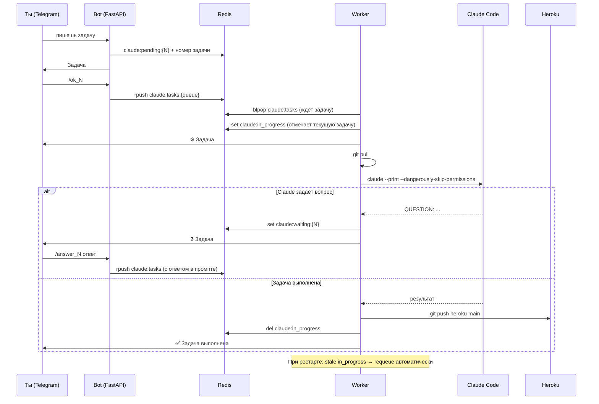

# Telegram → Claude Code → Heroku

## Как работает



---

## Быстрая установка

```bash
git clone <этот репо> && cd tg-claude-heroku
bash install.sh
```

Скрипт установит всё автоматически и подскажет что делать дальше.

---

## Ручная установка

### 1. Зависимости

```bash
sudo apt update && sudo apt install -y git curl nginx redis-server python3 python3-venv

# Node.js 20
curl -fsSL https://deb.nodesource.com/setup_20.x | sudo -E bash -
sudo apt install -y nodejs

# Claude Code CLI
sudo npm install -g @anthropic-ai/claude-code
claude auth   # ← авторизация (нужен Anthropic API key)

# Heroku CLI
curl https://cli-assets.heroku.com/install.sh | sh
```

### 2. Клонировать проект и настроить репо

```bash
# Клонировать твой проект
git clone YOUR_REPO_URL /opt/myproject
cd /opt/myproject

# Добавить heroku remote если ещё нет
heroku login
git remote add heroku https://git.heroku.com/YOUR_APP_NAME.git
```

### 3. Настроить бота

```bash
sudo mkdir -p /opt/tg-claude-heroku
cd /opt/tg-claude-heroku
python3 -m venv venv
source venv/bin/activate
pip install -r requirements.txt

cp .env.example .env
nano .env   # ← заполнить все переменные
```

### 4. SSL (нужен домен)

```bash
sudo apt install certbot python3-certbot-nginx
# Сначала поставить домен в nginx.conf, потом:
sudo certbot --nginx -d YOUR_DOMAIN
```

### 5. Запуск

```bash
sudo systemctl start tg-bot tg-worker

# Зарегистрировать webhook (один раз)
python setup_webhook.py
```

---

## Переменные окружения (.env)

| Переменная | Описание |
|---|---|
| `TELEGRAM_BOT_TOKEN` | Токен от @BotFather |
| `ALLOWED_USER_IDS` | Твой Telegram ID (узнать у @userinfobot) |
| `WEBHOOK_URL` | https://твой-домен/webhook |
| `REDIS_URL` | redis://localhost:6379 |
| `REPO_DIR` | Путь к папке с проектом, напр. /opt/myproject |
| `HEROKU_APP_NAME` | Название приложения на Heroku |
| `HEROKU_API_KEY` | API ключ с dashboard.heroku.com/account |
| `CLAUDE_TIMEOUT` | Таймаут для Claude Code (сек, по умолч. 300) |
| `DEPLOY_TIMEOUT` | Таймаут ожидания деплоя (сек, по умолч. 180) |

---

## Команды бота

- Любой текст — создаёт задачу в ожидании подтверждения (#N)
- `/ok_N` — подтвердить задачу #N (отправить в работу)
- `/cancel_N` — отменить задачу #N
- `/answer_N текст` — ответить на вопрос Claude по задаче #N
- `/queue` — очередь: ожидающие, задача в работе, статистика
- `/status` — результат последней задачи

---

## Что приходит в ответ

```
✅ Задача выполнена (⏱ 47.2с)

🚀 Деплой: ✅ Деплой успешен (slug: a1b2c3d4)

📂 Изменения:
 src/models/user.py  | 12 +++---
 src/views/login.py  |  3 +-

📋 Вывод Claude Code:
Я добавил валидацию email в модель User и обновил
форму логина...
```

---

## Логи

```bash
sudo journalctl -u tg-bot -f      # логи бота
sudo journalctl -u tg-worker -f   # логи воркера
redis-cli llen claude:tasks        # задач в очереди
redis-cli llen claude:failed       # упавших задач
```
